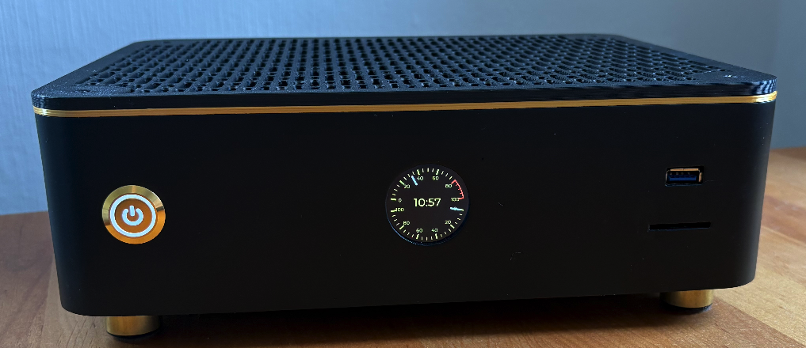
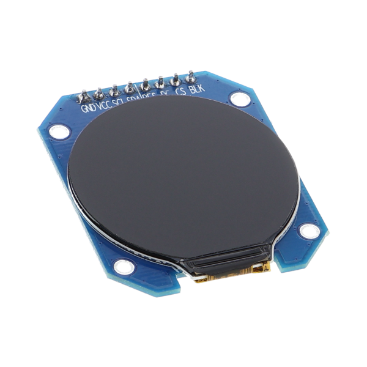

# ESP32-S3 System Monitoring Display

A real-time system monitoring display built with ESP32-S3 and a round GC9A01 LCD. Features dual analog meters for CPU temperature and load monitoring.


## Features

### **Dual Analog Meters**
- **CPU Temperature Meter**: 0-100°C with red warning zone (80-100°C)
- **CPU Load Meter**: 0-100% utilization monitoring

- **Auto-hiding Meters**: Automatically hides meters showing zero values for >1 minute
- **Display Power Management**: Blanks display after 1 minute of no data to save power
- **Boot Animation**: Rotating arc during startup



## Hardware Requirements

| Component | Specification | Notes |
|-----------|---------------|-------|
| **Microcontroller** | ESP32-S3 | ESP32-S3-Zero board |
| **Display** | GC9A01 240x240 Round LCD | 1.28" round display recommended |

The ESP32-S3-Zero board (<$4)  and the round GC9A01 (<$4) can be found in eBay or Aliexpress.





### Pin Configuration (ESP32-S3-Zero)

| Function | GPIO Pin | Description |
|----------|----------|-------------|
| **SCLK** | GPIO 1 | SPI Clock |
| **MOSI** | GPIO 2 | SPI Data Out |
| **DC** | GPIO 4 | Data/Command Select |
| **CS** | GPIO 5 | Chip Select |
| **RST** | GPIO 3 | Display Reset |
| **BL** | GPIO 6 | Backlight Control |
| **VCC** | 3.3V | Power Supply |
| **GND** | GND | Ground |

## Quick Start

### Prerequisites
- [PlatformIO](https://platformio.org/) installed
- ESP32-S3 development board (ESP32-S3-Zero)
- GC9A01 round LCD display

### Installation

1. **Wire the display**
   Connect your GC9A01 display according to the pin configuration above to the ESP32-S3-Zero.

2. **Build and upload**

   ```bash
   cd PlatformIO
   pio run --target upload
   ```


### Data Input Format

Send JSON data via serial at 115200 baud:

```json
{"time":"14:30:25","cpu_load":45,"cpu_temp":67}
```

| Field | Type | Range | Description |
|-------|------|-------|-------------|
| `time` | String | "HH:MM:SS" | Current time display |
| `cpu_load` | Integer | 0-100 | CPU utilization percentage |
| `cpu_temp` | Integer | 0-100 | CPU temperature in Celsius |

## Architecture

The project follows a clean, modular architecture with proper separation of concerns:

```
┌─────────────────┐    ┌─────────────────┐    ┌─────────────────┐
│   main.cpp      │    │ system_manager  │    │ ui_components   │
│                 │    │                 │    │                 │
│ • JSON parsing  │───▶│ • System        │───▶│ • Widget        │
│ • Coordination  │    │   logic         │    │   creation      │
│ • LVGL handler  │    │ • State mgmt    │    │ • Styling       │
└─────────────────┘    │ • Timeouts      │    │ • Animations    │
                       └─────────────────┘    └─────────────────┘
                                │
                                ▼
                       ┌───────────────────┐
                       │ display_driver    │
                       │                   │
                       │ • SPI comm        │
                       │ • LVGL integration│
                       │ • Hardware setup  │
                       └───────────────────┘
```

### File Structure of PlatformIO/

```
├── include/
│   ├── display_driver.h    # Hardware abstraction layer
│   ├── system_manager.h    # System logic and state management
│   └── ui_components.h     # UI widgets and styling
├── src/
│   ├── display_driver.cpp  # SPI and LVGL implementation
│   ├── system_manager.cpp  # System management and control logic
│   ├── ui_components.cpp   # Pure UI implementation
│   └── main.cpp            # Application entry point
└── platformio.ini          # PlatformIO configuration
```

## Configuration

### System Timeouts
Modify these constants in `include/system_manager.h`:

```cpp
#define METER_HIDE_TIMEOUT_MS    60000  // Hide meters after 1 minute of zeros
#define DISPLAY_BLANK_TIMEOUT_MS 60000  // Blank display after 1 minute no data
```

### Color Scheme
Customize colors in `include/ui_components.h`:

```cpp
#define METER_BLACK         METER_COLOR(0, 0, 0)        // Background
#define METER_WHITE         METER_COLOR(255, 255, 255)  // Needles
#define METER_GOLDEN_AMBER  METER_COLOR(181, 166, 66)   // UI elements
#define METER_BRIGHT_RED    METER_COLOR(255, 50, 50)    // Warnings
```

## System Behavior

### Startup Sequence
1. **Hardware Initialization**: SPI, display, LVGL setup
2. **UI Creation**: Meters, labels, boot animation
3. **System Manager**: State management initialization
4. **Boot Animation**: Rotating arc until first data received
5. **Main Interface**: Switch to monitoring display

### Automatic Features

#### **Meter Auto-hiding**
- Meters showing zero values for >1 minute automatically hide
- Instantly reappear when non-zero data is received
- Reduces visual clutter for unused metrics

#### **Power Management**
- Display blanks completely after 1 minute of no data
- Automatically restores when data resumes

#### **Data Processing**
- JSON validation with error handling
- 200Hz main loop for smooth animationsrs

## Development

### Dependencies
All dependencies are managed by PlatformIO:

```ini
lib_deps = 
    lovyan03/LovyanGFX@1.1.16     # Display driver
    lvgl/lvgl@8.3.11              # Graphics library
    bblanchon/ArduinoJson@6.21.3  # JSON parsing
```

### Compiler Configuration
The project includes compiler flags to suppress harmless warnings from the LVGL library:

```ini
build_flags =
    -D LV_CONF_INCLUDE_SIMPLE
    -D LV_CONF_PATH="lv_conf.h"
    -I include/
    -D ARDUINO_USB_MODE=1
    -D ARDUINO_USB_CDC_ON_BOOT=1
    ; Suppress LVGL deprecated enum warnings
    -Wno-deprecated-enum-enum-conversion
```

The `-Wno-deprecated-enum-enum-conversion` flag suppresses deprecated enum-enum conversion warnings that originate from LVGL library code, specifically from bitwise operations like `LV_PART_ANY | LV_STATE_ANY`. These warnings are harmless and don't affect functionality.

### Building
```bash
# Clean build
pio run --target clean

# Build only
pio run

# Build and upload
pio run --target upload

# Serial monitor
pio device monitor --baud 115200
```

### Testing Data

#### Linux/MacOS
Send test data via serial terminal:
```bash
echo '{"time":"12:34:56","cpu_load":75,"cpu_temp":82}' > /dev/ttyUSB0
```

#### Windows
Send test data via PowerShell or Command Prompt:
```powershell
# Using PowerShell
echo '{"time":"12:34:56","cpu_load":75,"cpu_temp":82}' | Out-File -FilePath COM3 -Encoding ASCII -NoNewline

# Or using Command Prompt with echo
echo {"time":"12:34:56","cpu_load":75,"cpu_temp":82} > COM3
```

**Note:** Replace `COM3` with your actual ESP32-S3 COM port (check Device Manager or PlatformIO device list).

You can also use PlatformIO's built-in serial monitor to send data:
```bash
pio device monitor --echo
```
Then type the JSON data directly in the terminal.

## Troubleshooting

### Common Issues

**Display not working:**

- Check SPI wiring connections
- Verify power supply
- Ensure correct GPIO pin assignments

**No data display:**

- Verify JSON format exactly matches specification
- Check serial baud rate (115200)
- Monitor serial output for parsing errors

**Compilation errors:**

- Update PlatformIO and libraries to latest versions
- Check ESP32-S3 board selection in platformio.ini (should be `lolin_s3_mini`)

### Debug Output
Enable verbose logging by monitoring serial output:
```bash
pio device monitor --baud 115200 --filter esp32_exception_decoder
```

## Contributing

Contributions are welcome! Please feel free to submit a Pull Request. For major changes, please open an issue first to discuss what you would like to change.

## License

This project is licensed under the MIT License - see the [LICENSE](LICENSE) file for details.

## Acknowledgments

- **LovyanGFX** - Excellent display driver library
- **LVGL** - Professional graphics library
- **ArduinoJson** - Efficient JSON parsings
